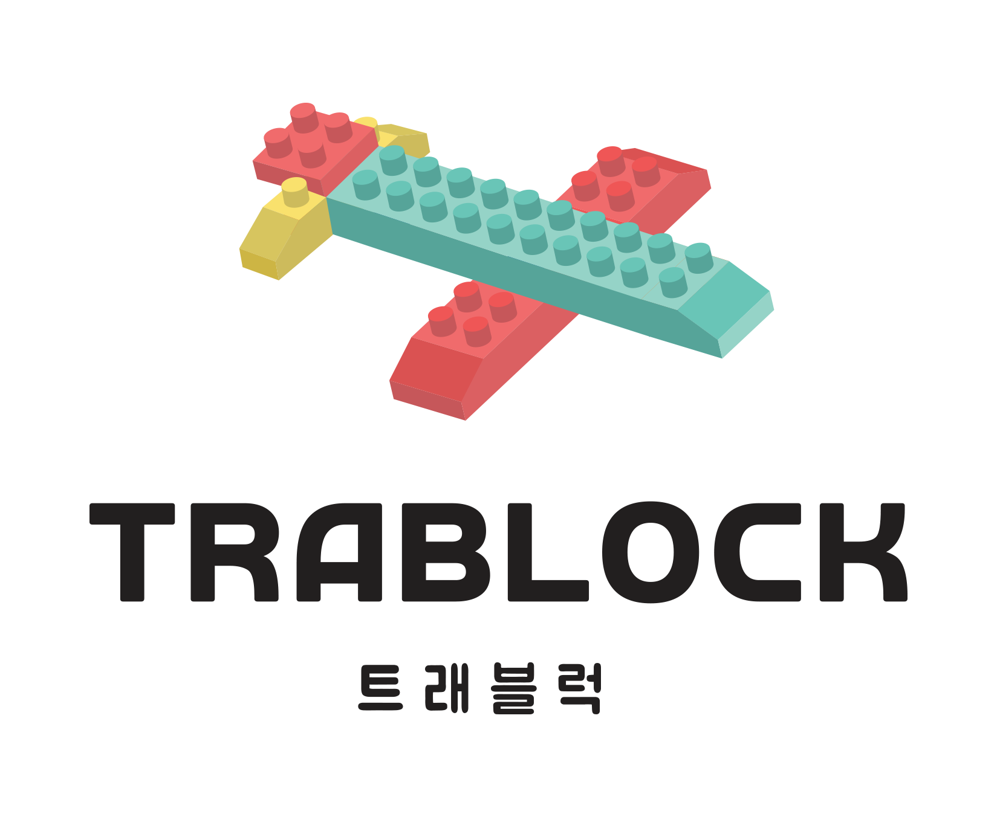

# ✈트래블럭(frontend)

  

배포 URL : [tra-block.com](tra-block.com)

## 1. 👨‍💻프론트엔드 개발 멤버 
 - 김영서 - 여행 보관함, 캔버스(여행 설정)
 - 신찬우 - 랜딩, 회원 인증, 캔버스(여행지 스케줄링)
 - 윤세원 - 캔버스(여행지 선택)
 - 탁하윤 - 마이페이지, 공지사항
 
 ## 2. 🗓개발 기간
 2021.11 ~ 2022.08
 
 ## 3. 📄주요 개발 페이지
  - 랜딩 페이지
  - 회원가입, 로그인
  - 마이페이지
  - 여행 보관함
  - 여행 캔버스
 
 ## 4. 🛠기술
- HTML, CSS, JavaScript(ES6+), React.Js
- Styled-Component, Zustand, Redux, Axios
